CUDA Stream Compaction
======================

**University of Pennsylvania, CIS 565: GPU Programming and Architecture, Project 2**

* Zhen Ren
  * https://www.linkedin.com/in/zhen-ren-837089208/
* Tested on: Windows 11, i9-13900H @ 2.60 GHz 16GB, RTX 4070 Laptop 8GB (Self laptop)

## Features

### Part 1: CPU Scan & Compaction

### Part 2: Naive GPU Scan
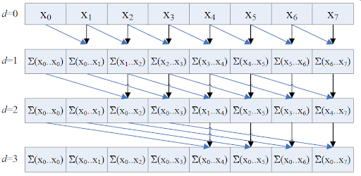

Dispatch naive scan kernel several times according to array lenth and do summation.

### Part 3: Work-Efficient GPU Scan & Stream Compaction
#### Part 3.1 Scan
Upsweep
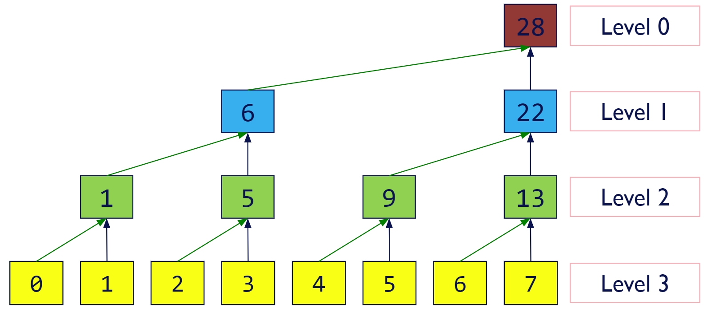
Downsweep
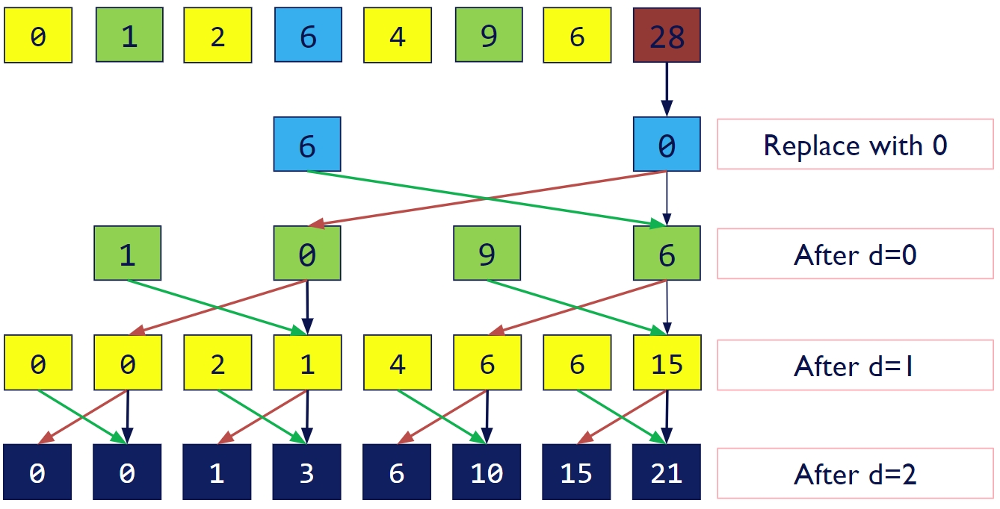

#### Part 3.2 Compaction
Implemented `StreamCompaction::Common::kernMapToBoolean` and `StreamCompaction::Common::kernScatter`. First, I converted the original array to bools. Then, I scanned the bools and used scatter function to compact the array.

### Part 4: Using Thrust's Implementation
Used `thrust::device_vector` and `thrust::exclusive_scan(first, last, result)`

### Part 5: Work Efficient Method Optimization (Extra Credit) (+5)
In each loop, the number of task increases or decreases exponentially, which produces many lazy threads if n threads are dispatched each time. Therefore, in the work efficient scan, I only dispatch 2^d threads each time to maximize occupancy.

### Part 7: GPU Scan Using Shared Memory && Hardware Optimization(Extra Credit) (+10)
[Referred to this tutorial](https://developer.download.nvidia.com/compute/cuda/1.1-Beta/x86_website/projects/scan/doc/scan.pdf)

#### Part 7.1 Algorithm

Instead of disptching a new upsweep or downsweep kernel for each level, I used shared memory to store all data and use one kernel to handle all the tasks.

The basic idea is simple: 
In the kernel, I first loaded source data to shared memory. Then, I use the kernel to do upsweep and downsweep. Finally, I write the data back to the global memory.

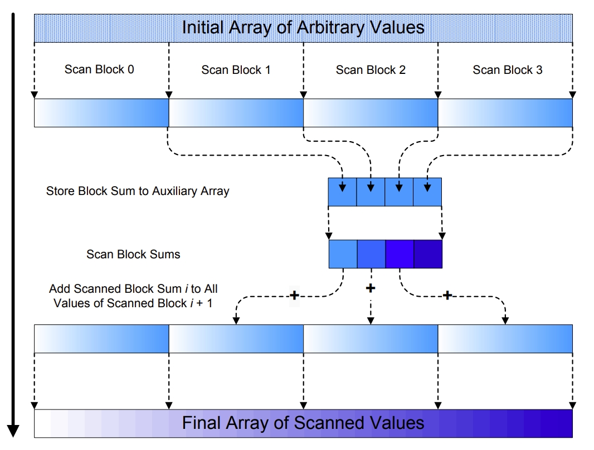

The first issue to encounter is that we cannot accomodate all data in the shared memory of a single block. Therefore, I seperated data to different blocks and do scan in each block. Then, when I have the sum of each block, which is stored in a Block Sum Array, I did a scan to this array again to get the increment value for each block. Finally, I implemented an Add kernel to add all data by the sum of previous blocks.

Sinec the Block Sum Array also needs to be scanned, I imeplment the scan function as a recursive function and when the Block Sum Array is small enough, I used a simple scan kernel to scan the Block Sum Array and terminated recursion.

#### Part 7.2 Optimizations
Since doing upsweep and downsweep in one block would produce many lazy threads, I half the number of threads and each thread would be responsible for two entries in global memory.

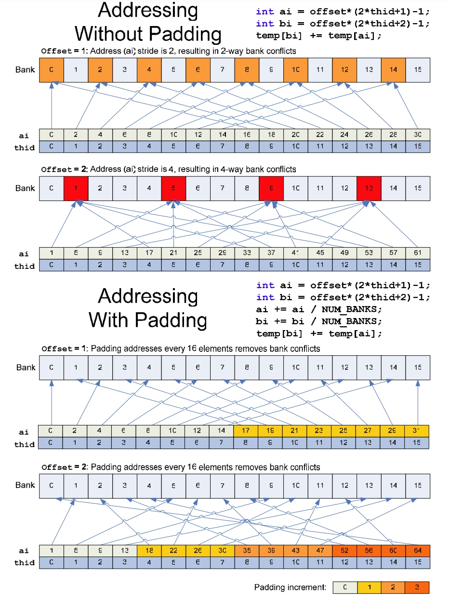
Another issue is bank conflict since accessing data in a power of two stride would result in severe bank conflict. Therefore, we can do padding when accessing shared memory. The way of doing padding is shown above. Note that the size of shared memory also need to be little greater than the number of elements to avoid index out of range.

The last issue is uncoaleased memory access. To solve this, the load operation changed from `int ai = 2 * tid; int bi = 2 * tid + 1;` to `int ai = tid; int bi = tid + (n >> 1);` which is more cache friendly. Also in the Add kernel, when I unroll the loop to add more elements each thread, I used the memory access pattern like this:
```
int stride = n >> 2;
int base = incr[bid];

odata[blockOffset] += base;
odata[blockOffset + 1 * stride] += base;
odata[blockOffset + 2 * stride] += base;
odata[blockOffset + 3 * stride] += base;
```
which turns out to be more cache friendly.

## Questions

### 1. Roughly optimize the block sizes of each of your implementations for minimal run time on your GPU.
After some simple test, the I set the block size of each implementation to be:
- Naive: 256
- Work Efficient: 512
- Work Efficient with Shared Memory: 512

### 2. Compare all of these GPU Scan implementations
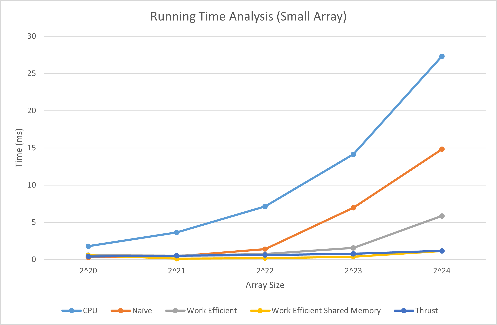
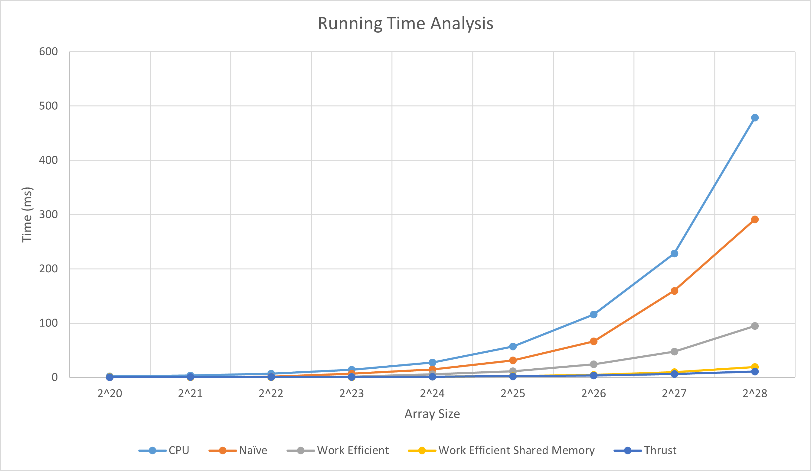

I tested arrays from 2^20 elements to 2^28 elements. The running time is increasing linearly, which is expected. The performance rank is generally:

`Thrust > Work Efficient Shared Memory > Work Efficient > Naive > CPU`

When array size is small (<2^23), my Work Efficient Shared Memory implementation is faster than Thrust and when array size is greater than 2^26, my imeplmentation is 1.5 to 2 times slower than thrust.

### 3. Analysis
From the Nsight System, we can see that Thrust first allocated some memory, then dispatched `DeviceScanInitKernel` and `DeviceScanKernel`, and finally freed the allocated memory.

**Thrust**
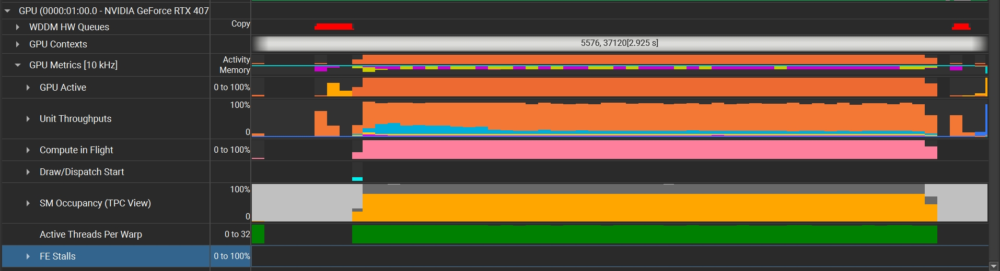
From the graph, we can see that the Thrust implementation has a stable and high occupancy and make full usage of shared memory and registers.

**Naive**
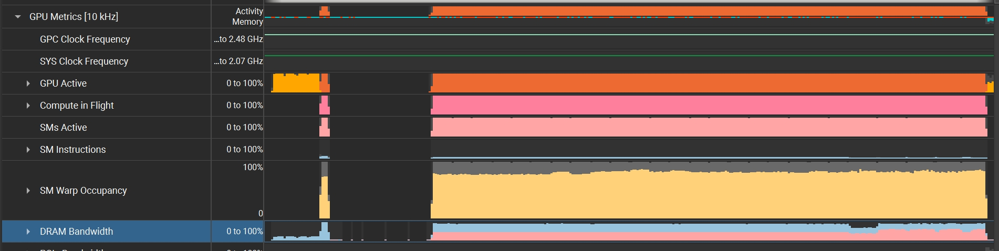
As for the naive implementation, the sm occupancy is lower since the kernel is very simple. The VRAM throughput is dominant so it is IO bottlenecked. Also, the time complexity of naive alogorithm is higher due to some dupliacted calculation.

**Work Efficient**
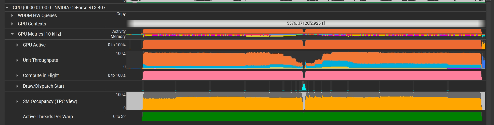
L1 and L2 throughput increases, and the algorithm is also more efficient compared with the naive one. SM throughput is still low and SM occupancy is also not full. At the point between the upsweep stage and the downsweep stage, the GPU utilization is obviously low. Therefore, the task allocation and memory IO may be the bottleneck.

**Work Efficient with Shared Memory**
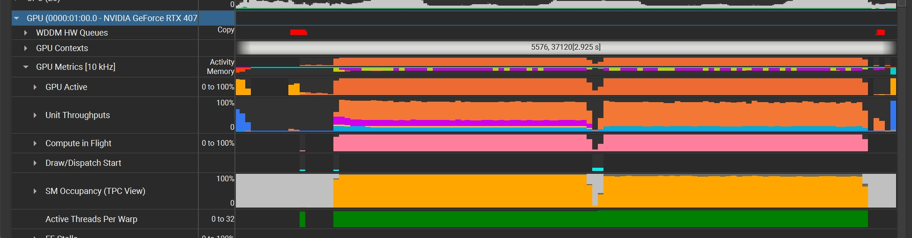
Compared with the Thrust implementation, we can see that recursive scan waste some time scanning small Block Sum Arrays. Also, the SM throughput is mcuh higher than all other implementations, including thrust, which means the complexity of the scan kernel is too high. My implementation is likely to be computation bounded.


### 4. Sample Output
```
****************
** SCAN TESTS **
****************
    [   3   4   3   7   6   2   5   5   1   8   0   1   0 ...   7   0 ]
==== cpu scan, power-of-two ====
   elapsed time: 113.623ms    (std::chrono Measured)
    [   0   3   7  10  17  23  25  30  35  36  44  44  45 ... 301989671 301989678 ]
==== cpu scan, non-power-of-two ====
   elapsed time: 113.378ms    (std::chrono Measured)
    [   0   3   7  10  17  23  25  30  35  36  44  44  45 ... 301989653 301989661 ]
    passed
==== naive scan, power-of-two ====
   elapsed time: 66.1965ms    (CUDA Measured)
    [   0   3   7  10  17  23  25  30  35  36  44  44  45 ... 301989671 301989678 ]
    passed
==== naive scan, non-power-of-two ====
   elapsed time: 66.1975ms    (CUDA Measured)
    [   0   3   7  10  17  23  25  30  35  36  44  44  45 ... 301989653 301989661 ]
    passed
==== work-efficient scan, power-of-two ====
   elapsed time: 23.6468ms    (CUDA Measured)
    passed
==== work-efficient scan, non-power-of-two ====
   elapsed time: 23.5411ms    (CUDA Measured)
    passed
==== work-efficient scan using shared memory, power-of-two ====
   elapsed time: 4.75341ms    (CUDA Measured)
    passed
==== work-efficient scan using shared memory, non-power-of-two ====
   elapsed time: 4.74317ms    (CUDA Measured)
    passed
==== thrust scan, power-of-two ====
   elapsed time: 3.12832ms    (CUDA Measured)
    passed
==== thrust scan, non-power-of-two ====
   elapsed time: 3.18554ms    (CUDA Measured)
    passed

*****************************
** STREAM COMPACTION TESTS **
*****************************
    [   3   2   2   1   0   3   2   3   2   0   2   3   3 ...   2   0 ]
==== cpu compact without scan, power-of-two ====
   elapsed time: 158.096ms    (std::chrono Measured)
    [   3   2   2   1   3   2   3   2   2   3   3   3   3 ...   3   2 ]
    expected 50331647 elements, got 50331647
    passed
==== cpu compact without scan, non-power-of-two ====
   elapsed time: 159.18ms    (std::chrono Measured)
    [   3   2   2   1   3   2   3   2   2   3   3   3   3 ...   3   3 ]
    expected 50331645 elements, got 50331645
    passed
==== cpu compact with scan ====
   elapsed time: 237.179ms    (std::chrono Measured)
    [   3   2   2   1   3   2   3   2   2   3   3   3   3 ...   3   2 ]
    expected 50331647 elements, got 50331647
    passed
==== work-efficient compact, power-of-two ====
   elapsed time: 29.2132ms    (CUDA Measured)
    [   3   2   2   1   3   2   3   2   2   3   3   3   3 ...   3   2 ]
    expected 50331647 elements, got 50331647
    passed
==== work-efficient compact, non-power-of-two ====
   elapsed time: 29.3131ms    (CUDA Measured)
    [   3   2   2   1   3   2   3   2   2   3   3   3   3 ...   3   3 ]
    expected 50331645 elements, got 50331645
    passed
==== work-efficient compact using shared memory, power-of-two ====
   elapsed time: 10.3116ms    (CUDA Measured)
    [   3   2   2   1   3   2   3   2   2   3   3   3   3 ...   3   2 ]
    expected 50331647 elements, got 50331647
    passed
==== work-efficient compact using shared memory, non-power-of-two ====
   elapsed time: 10.2433ms    (CUDA Measured)
    [   3   2   2   1   3   2   3   2   2   3   3   3   3 ...   3   3 ]
    expected 50331645 elements, got 50331645
    passed
Press any key to continue . . .
```